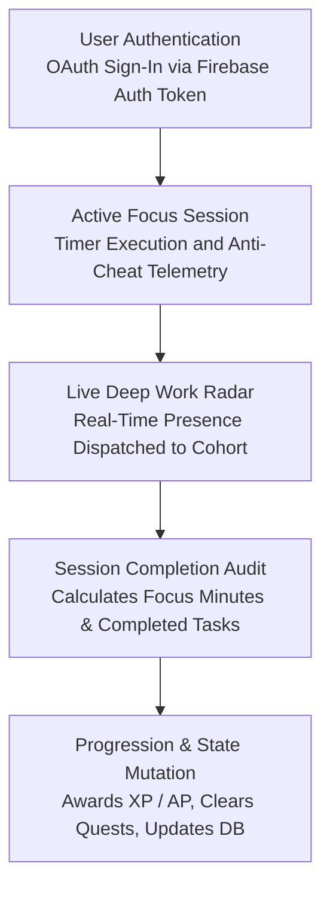

<div align="center">

# Ascend

**Disciplined deep work through structured progression and social accountability.**

A distraction-free productivity environment uniting custom focus intervals with real-time peer telemetry and procedural ambience.

<p>
  
  
</p>

[View Live Demo](https://ascend-study.vercel.app/)

</div>

---

## Introduction

Modern remote work and study regimens frequently suffer from digital distraction, isolation, and a lack of quantifiable feedback loops. Conventional timer tools provide basic interval counting but fail to instill sustained behavioral discipline or peer accountability.

Ascend was engineered to address this deficit by synthesizing disciplined interval methodology with systematic progression mechanics and synchronized peer telemetry. Designed for students, researchers, and technical professionals requiring uninterrupted cognitive immersion, the platform balances strict focus enforcement with habit formation architectures.

All core operations prioritize client-side efficiency, zero external asset overhead, and low-latency state synchronization across distributed cohorts.

> **Disclaimer:** This project is actively in development. The architecture, telemetry protocols, and design systems documented here represent the current active milestone and are subject to ongoing development prior to final version release.

## Features

- **Adaptive Focus Engine:** Execute standard Pomodoro routines or custom open-ended stopwatch intervals with granular task-level time logging.
- **Strict Anti-Cheat Protocols:** Enforce focus integrity through automated window-blur listeners and tab-visibility detection that penalize unauthorized application switching.
- **Active Verification Prompts:** Prevent idle accumulation of focus metrics through randomized operational check-in modals requiring user acknowledgment.
- **Procedural Ambience Generator:** Synthesize acoustic environments including Rain, Campfire, Ocean, Forest, Brown Noise, and White Noise directly via the native Web Audio API with zero external audio files.
- **Ambient Canvas Scenes:** Render GPU-accelerated CSS animations calibrated to active soundscape profiles without taxing system memory.
- **Social Cohort Command:** Establish private workspaces supporting up to thirty operatives authenticated via distinct six-character invite codes.
- **Live Deep Work Radar:** Transmit and observe real-time focus indicators across cohort member rosters with automated presence signaling.
- **Cooperative Bounties:** Aggregate focus hours across cohorts to fulfill collective weekly targets and build team accountability.
- **Global & Regional Arena:** Track relative operational output through all-time and weekly leaderboards computed from verified session minutes.
- **Intermission Wellness Protocols:** Guide physical recovery between study cycles through structured box breathing, 20-20-20 ocular rest routines, and ergonomics drills.
- **Responsive Command Interface:** Navigate a fully responsive, monochrome interface featuring sliding navigation drawers and mobile-optimized telemetry views.

## Tech Stack

### Frontend Architecture
- **React 19:** Modern component-driven UI architecture utilizing React Context for centralized state orchestration.
- **TypeScript:** End-to-end static typing and interface enforcement across all data models and services.
- **Vite 8:** Next-generation frontend tooling providing lightning-fast Hot Module Replacement and optimized production bundling.
- **Tailwind CSS v4:** High-performance utility-first styling delivering a strict, distraction-free monochrome aesthetic.

### Backend & Cloud Infrastructure
- **Firebase Authentication:** Secure Google OAuth integration providing frictionless, authenticated user sessions.
- **Cloud Firestore:** Low-latency NoSQL database handling real-time document streaming and cohort state updates.

### Audio & Graphics Engineering
- **Web Audio API:** Native browser digital signal processing generating custom procedural soundscapes via mathematical waveforms and filtered noise buffers.
- **Framer Motion:** Declarative animations powering smooth layout transitions, modal presentations, and micro-interactions.

## Project Structure

```text
ascend/
│   # Application entry, styles, and configurations
├── App.tsx
├── main.tsx
├── index.css
├── package.json
├── tsconfig.json
├── vite.config.ts
│
├── public/                # Static vector assets and metadata
│   ├── favicon.svg
│   └── icons.svg
│
└── src/
    ├── assets/            # Static application imagery
    │
    ├── components/        # Reusable UI modules
    │   ├── AmbienceBackground.tsx # GPU-driven background visualizer
    │   ├── AmbiencePlayer.tsx     # Soundscape generation controller
    │   ├── BreakOverlay.tsx       # Guided wellness intermission system
    │   ├── ConsistencyMatrix.tsx  # Annual focus density matrix
    │   └── Sidebar.tsx            # Responsive navigation drawer
    │
    ├── context/           # Global state providers
    │   ├── SessionContext.tsx     # Timer parameters, tasks, and anti-cheat tracking
    │   └── UserContext.tsx        # Progression, unlocks, and telemetry sync
    │
    ├── lib/               # Core business logic and integrations
    │   ├── achievements.ts        # Milestone definitions and requirements
    │   ├── ambience.ts            # Procedural audio synthesis engine
    │   ├── auth.ts                # Authentication helper interfaces
    │   ├── cohorts.ts             # Cohort management and member pipelines
    │   ├── constants.ts           # Store items, daily directives, and rank tiers
    │   ├── firebase.ts            # Firebase application and database initialization
    │   └── telemetry.ts           # Analytics calculations and historical aggregation
    │
    └── pages/             # Top-level route views
        ├── Achievements.tsx       # Milestone inspection view
        ├── ActiveSession.tsx      # Primary execution timer and strict mode controller
        ├── Cohorts.tsx            # Collaborative lobby and live radar hub
        ├── CreateSession.tsx      # Session initialization and task assignment
        ├── Dashboard.tsx          # Main telemetry overview and active directives
        ├── Leaderboard.tsx        # Global performance rankings
        ├── Login.tsx              # Authentication entry portal
        ├── Profile.tsx            # User statistics, loadout, and identity
        ├── Sessions.tsx           # Historical session records
        └── Store.tsx              # Progression rewards and unlock catalog
```

## How It Works

The platform operates through a stateful execution cycle coordinating client-side focus validation with real-time distributed telemetry:



> **Note:** Ascend operates on a decentralized client-side computation model. Procedural soundscapes are calculated mathematically in real time through oscillator nodes and noise buffers in the native Web Audio API, eliminating the need for streaming assets or media storage bandwidth.

## Getting Started

### Prerequisites
- Node.js (version 18.0.0 or higher)
- npm (version 9.0.0 or higher) or compatible package manager
- Git command line utility

### Installation
Clone the repository and install the project dependencies:
```bash
git clone https://github.com/Arunan-Kavirajan/Ascend.git
cd Ascend
npm install
```

### Development
Launch the local development environment:
```bash
npm run dev
```
Navigate to `http://localhost:5173` in your browser.

### Build
Generate an optimized production build:
```bash
npm run build
```

### Environment Configuration
Ascend requires connection parameters for a Firebase project supporting Authentication and Cloud Firestore. Configure these keys within a `.env` file at the project root:

| Variable Key | Description | Example Format |
|---|---|---|
| `VITE_FIREBASE_API_KEY` | Firebase public web client API key | `AIzaSy...` |
| `VITE_FIREBASE_AUTH_DOMAIN` | Firebase authentication routing domain | `project-id.firebaseapp.com` |
| `VITE_FIREBASE_PROJECT_ID` | Google Cloud and Firebase unique project identifier | `project-id` |
| `VITE_FIREBASE_STORAGE_BUCKET` | Cloud Storage bucket locator | `project-id.firebasestorage.app` |
| `VITE_FIREBASE_MESSAGING_SENDER_ID` | Cloud messaging sender numeric identifier | `123456789012` |
| `VITE_FIREBASE_APP_ID` | Firebase web application unique registration ID | `1:123456789012:web:abcdef...` |
